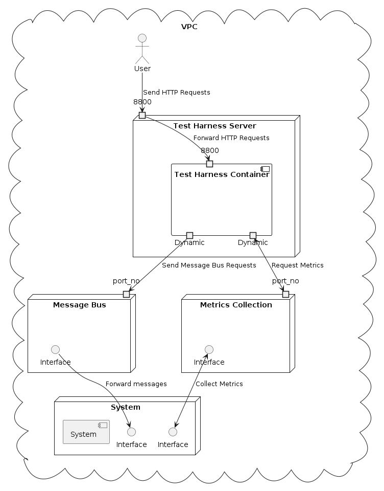

<!-- PROJECT LOGO -->
<br />
<div align="center">
  <a href="https://github.com/github_username/repo_name">
    
    </a>

<h3 align="center">Erebus</h3>

  <p align="center">
    Erebus is a powerful, open-source test harness designed to bring flexibility and robustness to your software testing workflow. Named after the primordial deity of darkness in Greek mythology, Erebus sheds light on the hidden corners of your software systems, uncovering performance bottlenecks and functional issues.
    <br />
    <!-- <a href="https://github.com/github_username/repo_name"><strong>Explore the docs »</strong></a> -->
    <!-- <br /> -->
    <br />
    <a href="https://github.com/github_username/repo_name">View Demo</a>
    ·
    <a href="https://github.com/xtuml/erebus/issues/new">Report Bug</a>
    ·
    <a href="https://github.com/github_username/repo_name/issues/new?labels=enhancement&template=feature-request---.md">Request Feature</a>
  </p>
</div>

<!-- TABLE OF CONTENTS -->
<details>
  <summary>Table of Contents</summary>
  <ol>
    <li>
    <a href="#Introduction">Introduction</a>
      <ul>
        <li><a href="#what-is-erebus">What is Erebus?</a></li>
        <li><a href="#key-features">Key Features</a></li>
      </ul>
    </li>
    <li><a href="#quickstart-guide">Quickstart Guide</a></li>
    <li>
      <a href="#installation-guide">Installation Guide</a>
      <ul>
        <li><a href="#prerequisites">Prerequisites</a></li>
        <li><a href="#using-docker-compose-recommended">Using Docker Compose (Recommended)</a></li>
        <li><a href="#manual-installation-for-development">Manual Installation (For Development)</a></li>
      </ul>
    </li>
    <li><a href="#deployment">Deployment</a>
      <ul>
        <li><a href="#building-docker-image-and-running-container">Building Docker Image and Running Container</a></li>
        <li><a href="#configuration">Configuration</a>
        </li>
      </ul>
    </li>
    <li><a href="#usage">Usage</a>
      <ul>
        <li><a href="#test-configuration">Test Configuration</a></li>
          <ul>
            <li><a href="#fields-in-json-and-yaml-files">Fields in JSON and YAML Files</a></li>
            <li><a href="#example-json-test-config">Example JSON Test Config</a></li>
            <li><a href="#example-yaml-test-config">Example YAML Test Config</a></li>
          </ul>
        <li><a href="#flask-service">Flask Service</a>
          <ul><li><a href="#running-a-test">Running a Test</a></li></ul>
        </li>
        <li><a href="#command-line-interface-cli">Command Line Interface (CLI) - not working currently</a></li>
        <li><a href="#test-reports">Test Reports</a></li>
      </ul>
    </li>
  </ol>
</details>

***
# Introduction
## What is Erebus?
At its core, Erebus is an extensible testing framework that empowers developers and QA engineers to conduct comprehensive performance and functional tests on diverse software systems. Whether you're optimising a high-traffic web service or ensuring the reliability of a complex event-driven application, Erebus provides the tools you need.

## Key Features
* 🔧 Extensible Architecture: Tailor Erebus to fit your unique testing requirements.
* 🚀 Performance Testing: Identify bottlenecks and optimise your system's speed.
* ✅ Functional Testing: Ensure every component works as intended.
* 🌐 Multi-Protocol Support: Send test files via HTTP, Kafka, and more.
* 🛠️ Easy Test Setup: Streamlined base functionality for quick test configuration.

Erebus isn't just a tool; it's a test harness that adapts to your needs, ensuring your software not only works but excels under real-world conditions.
***
# Quickstart Guide
1. **Clone the repo**:
```sh
git clone https://github.com/xtuml/erebus.git
cd erebus
```
2. **Run with docker compose**:
```sh
docker compose up --build
```

This assumes you have docker installed on your machine (https://www.docker.com/products/docker-desktop/)
***
# Installation Guide

## Prerequisites
Before installing Erebus, ensure you have the following:
* Python (v3.11 or later)
* Docker (latest stable version)

Python 3.11 introduces performance improvements and new features that Erebus leverages for efficient test execution. Docker is used for containerisation, ensuring consistent environments across different setups.

## Using Docker Compose (Recommended)
We provide a Docker Compose file that sets up Erebus with the correct volumes, ports, and environment variables. This is the easiest and most consistent way to run Erebus:

1. **Clone the repo**:
```sh
git clone https://github.com/xtuml/erebus.git
cd erebus
```
2. **(Optional) Customise settings**:
* Configure Erebus by copying the `./test_harness/config/default_config.config` file to `./config/config.config`
```sh
mkdir -p config && cp ./test_harness/config/default_config.config ./config/config.config # MacOS, Linux

New-Item -ItemType Directory -Name "config"
Copy-Item -Path ".\test_harness\config\default_config.config" -Destination ".\config\config.config" # Windows Powershell
```
* Override settings by copying the setting under `[non-default]`. Eg.
```sh
[DEFAULT]
requests_max_retries = 5
requests_timeout = 10

[non-default]
requests_max_retries = 10 # This will override the default setting
```
3. **Build and run using Docker Compose**:
```sh
docker compose up --build
```

## Manual Installation (For Development)
If you're contributing to Erebus or need a custom setup:
1. **Reopen IDE in dev container**:

```sh
# Clone and navigate
git clone https://github.com/yourusername/erebus.git
cd erebus
```
To ensure consistency in the working environment, it is recommended that the dev container provided in `.devcontainer/devcontainer.json` is used. 


2. **Setup virtual environment and install packages:**

```sh
# Run install script for test-event-generator (Janus)
# https://github.com/xtuml/janus
chmod +x ./scripts/install_repositories.sh && ./scripts/install_repositories.sh

# Create and activate a virtual environment
python3.11 -m venv venv
source venv/bin/activate  # On Windows, use `venv\Scripts\activate`

# Install dependencies
pip install -r requirements.txt
```
***
# Deployment
It is recommended to deploy the test harness in the same VPC (or private network) as the machine containing the system to be tested to avoid exposure to the public internet. 



## Building Docker Image and Running Container
1. **Build Docker Image**:
```sh
docker build -t test-harness:latest .
```
2. **Run application**:
```sh
cd deployment

docker compose up
```
3. **Stop application**:

There are 2 ways to stop the container running (ensure you are in `/deployment`):

* `Ctrl + C` 

* `docker compose stop`

To destroy the container:

`docker compose down`

## Configuration

Default config file: `test_harness/config/default_config.config` (project root directory). 
Custom config file: Place in `deployment/config` named `config.config`.

To override defaults, copy the parameter under `[non-default]` heading and set a new value. Parameters:

#### General Config
* `requests_max_retries`: int - Max retries for synchronous requests. Default: `5`
* `requests_timeout`: int - Timeout in seconds for synchronous requests. Default: `10`

#### Log Reception and Finishing Time Parameters
* `log_calc_interval_time`: int (deprecated, set in test config under `test_finish > metrics_get_interval`) - Interval between log file requests. Default: `5`

#### Metrics Collection Config
* Kafka Metrics Collection:
  * `metrics_from_kafka`: bool - Collect metrics from a Kafka topic. Default: `False`
  * `kafka_metrics_host`: str - Kafka host for metrics. Default: `host.docker.internal:9092`
  * `kafka_metrics_topic`: str - Kafka topic for metrics. Default: `default.BenchmarkingProbe_service0`
  * `kafka_metrics_collection_interval`: int - Interval in seconds to collect metrics. Default: `1`

#### Sending Files Config
* `message_bus_protocol`: str - Protocol for sending data (defaults to `HTTP` for incorrect configs):
  * `HTTP`: Use HTTP protocol
  * `KAFKA`: Use Kafka
  * `KAFKA3`: Use Kafka3 module (more performant)

* Kafka Config (if `message_bus_protocol` is "KAFKA" | "KAFKA3"):
  * `kafka_message_bus_host`: str - Kafka host for messages. Default: `host.docker.internal:9092`
  * `kafka_message_bus_topic`: str - Kafka topic for messages. Default: `default.AEReception_service0`

* HTTP Server Config (if `message_bus_protocol` is "HTTP"):
  * `pv_send_url`: str - Endpoint URL for uploading events. Default: `http://host.docker.internal:9000/upload/events`
***
# Usage
Currently there are two main ways to use the Test Harness:
* Flask Service - A flask service that serves http requests to run the test harness
* Command Line Interface (CLI) Tool - not currently working

## Test Configuration
For each method, a custom test configuration can be passed at runtime in the form of JSON (Flask) or YAML (CLI).

### Fields in JSON and YAML Files
* `type`: `"Functional"` | `"Performance"` : `str`
  * `"Functional"`: Tests the system's functionality
  * `"Performance"`: Tests the system's performance

* `performance_options`: `dict` (for `"Performance"` type only)
  * `num_files_per_sec`: `int` >= 0 - Number of test events per second

* `num_workers`: `int`
  * Number of worker processes for sending files
  * `0` or less: Runs in serial (default)
  * Non-integer: Program fails

* `aggregate_during`: `bool`
  * `True`: Aggregate metrics during the test
  * `False`: Do not aggregate (default)
  * If `low_memory` is `True`, this value is ignored and metrics are aggregated

* `sample_rate`: `int`
  * Approximate number of events to sample per second
  * `0` or less: No sampling (default)

* `low_memory`: `bool`
  * `True`: Save results to memory/disk, aggregate metrics
  * `False`: Do not save results to memory/disk (default)
  * If `True`, `aggregate_during` is ignored

* `test_finish`: `dict`
  * Options for stopping a test
  * `metric_get_interval`: `int` >= 0, default 5 - Interval to grab metrics
  * `finish_interval`: `int` >= 0, default 30 - Interval to check for metric changes (multiple of `metric_get_interval`)
  * `timeout`: `int` >= 0, default 120 - Time to wait after all data is sent

### Example JSON Test Config
```json
{
    "type":"Performance",
    "performance_options": {
        "num_files_per_sec": 10,
    },
    "num_workers": 0,
    "aggregate_during": false,
    "sample_rate": 0,
    "low_memory": false
}
```

### Exmaple YAML Test Config
```yaml
type: "Functional"
performance_options:
  num_files_per_sec: 10
num_workers: 0
aggregate_during: False
sample_rate: 0
low_memory: False
```

## Flask Service
The flask service can be run in two ways:

#### Run with Docker:
* Following the instructions in <b>Deployment</b>:<b>Building Docker Image and Running Container</b> above. The following should then appear in stdout:
    ```sh
    [+] Building 0.0s (0/0)                                                             
    [+] Running 2/2
     ✔ Network test-harness_default           Cr...                                0.1s 
     ✔ Container test-harness-test-harness-1  Created                              0.0s 
    Attaching to test-harness-test-harness-1
    test-harness-test-harness-1  | INFO:root:Test Harness Listener started
    test-harness-test-harness-1  |  * Serving Flask app 'test_harness'
    test-harness-test-harness-1  |  * Debug mode: off
    test-harness-test-harness-1  | INFO:werkzeug:WARNING: This is a development server. Do not use it in a production deployment. Use a production WSGI server instead.
    test-harness-test-harness-1  |  * Running on all addresses (0.0.0.0)
    test-harness-test-harness-1  |  * Running on http://127.0.0.1:8800
    test-harness-test-harness-1  |  * Running on http://172.24.0.2:8800
    test-harness-test-harness-1  | INFO:werkzeug:Press CTRL+C to quit
    ```

#### Run as a Python Script:
* Following the instructions in <b>Installation</b>: <b>Manual Installation (For Development)</b> and then running the following command from the project root (with a custom harness config file)

    `python -m test_harness.run_app --harness-config-path <path to harness config file>`

    Once one of this has been followed the following should appear in stdout of the terminal:
    ```sh
    INFO:root:Test Harness Listener started
     * Serving Flask app 'test_harness'
     * Debug mode: off
    INFO:werkzeug:WARNING: This is a development server. Do not use it in a production deployment. Use a production WSGI server instead.
     * Running on all addresses (0.0.0.0)
     * Running on http://127.0.0.1:8800
     * Running on http://172.17.0.3:8800
    INFO:werkzeug:Press CTRL+C to quit
    ```

#### <b>Serving the SwaggerUI</b>
Once the server is running locally, the SwaggerUI can be accessed from http://127.0.0.1:8800/apidocs in any browser. This is a simple UI page designed using Swagger/OpenAPI3 to execute Test-Harness commands without needing the terminal or curl commands as detailed below.

### Running a Test

#### Preparation Stages Before `/startTest`

1. **(Optional) Upload a Performance Profile**: 
   * Upload a CSV file to specify points in simulation time where the number of test files sent per second is described. 
   * CSV headers: "Time", "Number".
   * Endpoint: `/upload/profile`, MIME type: `multipart/form`.
   * Example:
     ```sh
     curl --location --request POST 'http://127.0.0.1:8800/upload/profile' --form 'file1=@"test_profile.csv"'
     ```

2. **(Optional) Upload Test Job Files**: 
   * Upload multiple test files suitable for the system.
   * Endpoint: `/upload/test-files`, MIME type: `multipart/form`.
   * Example:
     ```sh
     curl --location --request POST 'http://127.0.0.1:8800/upload/test-files' --form 'file1=@"test_file"'
     ```

3. **(Recommended) Upload Test Case Zip Files**: 
   * Include all necessary test data in a zip file.
   * Zip structure:
     ```sh
     TCASE
     ├── profile_store (optional)
     │   └── test_profile.csv (optional)
     ├── test_config.yaml (optional)
     └── test_file_store (optional)
         ├── test_data_1 (optional)
         └── test_data_2 (optional)
     ```
   * Endpoint: `/upload/named-zip-files`, MIME type: `multipart/form`.
   * The zip file's form name creates the `TestName` for the JSON body in `/startTest`.
   * Example:
     ```sh
     curl --location --request POST 'http://127.0.0.1:8800/upload/named-zip-files' --form '<TestName>=@"<Test zip file path>"'
     ```

#### Start Test

* Send a POST request with JSON test data to start the test.
* Endpoint: `/startTest`, Header: `'Content-Type: application/json'`.
* JSON fields:
  * `"TestName"`: `str` - Name of the test (random UUID if not provided). Matches the zip file form name if using `/upload/named-zip-files`.
  * `"TestConfig"`: `dict` - Configuration for the test.
* Example:
  ```sh
  curl -X POST -d '{"TestName": "A_performance_test", "TestConfig":{"type":"Performance", "performance_options": {"num_files_per_sec":10}}}' -H 'Content-Type: application/json' 'http://127.0.0.1:8800/startTest'

#### Check If A Test Is Running
To check if a test is running:
```sh
curl 'http://127.0.0.1:8800/isTestRunning'
```

#### Stopping a Test

To stop a test gracefully, send a POST request with an empty JSON body to the `/stopTest` endpoint. Use the header `'Content-Type: application/json'`. A successful response returns `200 OK`, and a failure returns `400`.

Example:
```sh
curl -X POST -d '{}' -H 'Content-Type: application/json' 'http://127.0.0.1:8800/stopTest'
```

#### Retrieving Output Data

To retrieve output data from a finished test, send a POST request with a JSON body to the `/getTestOutputFolder` endpoint. Use the header `'Content-Type: application/json'`. Specify the `TestName` from the `/startTest` request.

JSON body format:
```json
{
    "TestName": "<name of test>"
}
```

A successful request returns a zip file (MIME type: `application/zip`) containing all test output data.

Example:
```sh
curl -X POST -d '{"TestName": "test_1"}' -H 'Content-Type: application/json' 'http://127.0.0.1:8800/getTestOutputFolder' --output <file_name>.zip
```
***

## Command Line Interface (CLI)

Work In Progress
***

## Test Reports

Test reports are stored in directories named after the `"TestName"` field sent in the POST request to `/startTest` endpoint. These directories reside in the `report_output` directory.

- For deployments using Docker, the report output folder is located at `deployment/report_output` relative to the project root directory.
- For deployments using the command `python -m test_harness.run_app --harness-config-path <path to harness config file>`, the default report output folder is `test_harness/report_output` relative to the project root directory. Users can customise this location by editing the `report_file_store` field in the `test_harness/config/store_config.config` file.
- For CLI tool usage, the default report output folder is `test_harness/report_output`. If the `--outdir` option is specified, the report files will be saved accordingly.

#### <b>Functional</b>
Arbitrary functional results
#### <b>Performance</b>
Arbitrary performance results