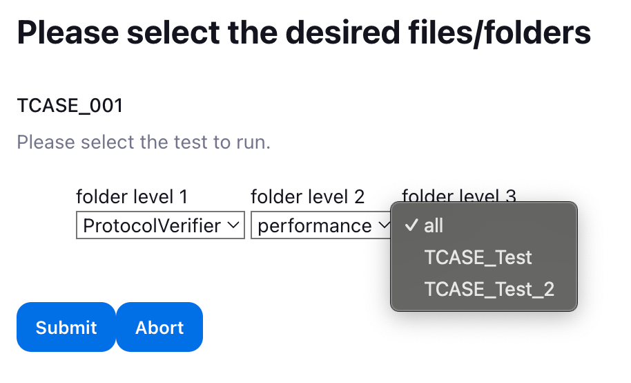

# Jenkins Integration

## Installation
### PV setup
For Jenkins to interact with the Server that the Protocol Verifier is installed on it is required to copy the `docker-compose-1AER*.yml` files and `*.sh` files from the `ci/jenkins/scripts` directory to the Protocol Verifier `deploy` directory (these files should be changed according to the location that Kafka has).

The docker compose files refer to the service `http_server`. The tagged docker image version within those files `http-server:latest` should be built, named and tagged from the HTTP server repo under the latest tagged version of that repo (see `docs/protocol_verifier/README.md` for more information on the location of the repos).

### Enable ssh root access on PV from Jenkins
* Create/use a key pair on the Jenkins box
* ssh on to the Protocol Verifier box
* relog as root (sudo su -l root)
* if authorized_keys isn't present at /root/.ssh , create it
* add the pubkey of whatever keypair you are using on the Jenkins you'll be using to that authorized_keys file
### Jenkins Configurations
The Jenkins pipeline can be run by copying the text of the pipeline.groovy file into the 'Configure > Pipeline' section in Jenkins.

Before the pipeline is run, care must be taken that the environment variables at the top of the script are set correctly. These environment variables are;

* `DATA_HOME`: Specifies the path for test case scripts.
* `OUTPUTS`: Points to the workspace directory for test harness outputs.
* `PV_BOX` and `TH_BOX`: Define IP addresses for specific test environments (protocol verifier and test harness, respectively).
* `CONFIG_FILE_NAME`: The name of the configuration file used in testing.

## Running
When the pipeline is started, the user is given the option to upload a custom test file. This will restrict the pipeline from running multiple tests in sequence, but allows for greater flexibility in the case that the desired test is only going to be run once and is therefore not present in the test harness repo.

After and if a custom test file has been uploaded, the name of the test and number of processing (aka ‘AEO’) containers should be selected.

Alternatively, if the user does not provide a custom test file then the pipeline can be used to start one or more tests that have been selected from the collection provided in the aforementioned test harness repo, which will either be named as appropriate using the list of names provided or given GUIDs if no/not enough names are provided. The number of processing (aka ‘AEO’) containers can also be selected at this stage.

Subsequent to this, the user is presented with dropdown boxes corresponding the folders in the Test Harness repo that contain tests. A single test (or all tests) in any of these folders can be selected.

After the test has been selected, the jenkins pipeline will first start the protocol verifier on the configured environment.

After that, the pipeline will upload the selected test archive and start the test.

The pipeline will then periodically query the protocol verifier in order to determine progress for the currently-running test.

After this, the pipeline will stop the protocol verifier process and then archive any test output.

The reports generated in the tests can then be viewed by selecting the item ‘Report_[TESTNAME]’ on the left-hand side of the menu for that particular pipeline run, where all HTML reports generated for that test may be viewable or downloaded as a zip.

The raw test output zip can also be downloaded as required by using the ‘Workspaces’ menu item.

