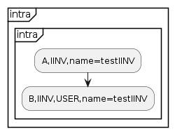
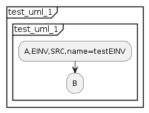
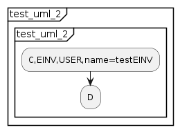

# Invariants
## Introduction
Invariants are bits of information that should be unchanged as a job progresses. Events that share the same named invariant (in the job definition puml) should have exactly the same value for that named invariant at run time. Invariants within the Protocol Verifier come in two types:
* Intra-job invariants
* Extra-job invariants

For more information on invariants see for official documentation: https://github.com/xtuml/munin/blob/main/doc/howto/PLUS_guide.adoc

## Intra-job Invariants
Intra job invariants are named invariants that are shared within the same job. 

An example of an intra job invariant puml is shown below:



An example of the intra job invariant audit event stream for a single job is shown below:
```
[
    {
        "jobId": "2b119398-bbf0-4c8a-81ce-7e268d9a327a",
        "jobName": "intra",
        "eventType": "A",
        "eventId": "9022a3b7-abdf-49e4-8151-f9f1dff0a975",
        "timestamp": "2023-10-25T08:22:43.025363Z",
        "applicationName": "default_application_name",
        "testIINV": "f8549673-16a7-43e1-a05c-69667753e775"
    },
    {
        "jobId": "2b119398-bbf0-4c8a-81ce-7e268d9a327a",
        "jobName": "intra",
        "eventType": "B",
        "eventId": "a0ce4650-047f-4299-be1b-42ec72eff99a",
        "timestamp": "2023-10-25T08:22:43.025917Z",
        "applicationName": "default_application_name",
        "previousEventIds": [
            "9022a3b7-abdf-49e4-8151-f9f1dff0a975"
        ],
        "testIINV": "f8549673-16a7-43e1-a05c-69667753e775"
    }
]
```

## Extra-job Invariants
Extra-job invariants are named invariants that are shared across multiple jobs.

They are defined in the job definition pumls and have a source in one job and a user (or multiple users) in another job. An example of two job definitions sharing an extra-job invariant are shown below:



An example of an extra job invariant audit event stream for two jobs is shown below:
```
[
    {
        "jobId": "1",
        "jobName": "test_uml_1",
        "eventType": "A",
        "eventId": "8628fdb6-48e7-4eab-9c9d-95bcbe48b7d0",
        "timestamp": "2023-09-21T14:35:09.728704Z",
        "applicationName": "default_application_name",
        "testEINV": "some invariant"
    },
    {
        "jobId": "1",
        "jobName": "test_uml_1",
        "eventType": "B",
        "eventId": "ad46fae5-4970-4e7d-90d2-eb23d83f63ec",
        "timestamp": "2023-09-21T14:35:09.728783Z",
        "applicationName": "default_application_name",
        "previousEventIds": [
            "8628fdb6-48e7-4eab-9c9d-95bcbe48b7d0"
        ]
    },
    {
        "jobId": "2",
        "jobName": "test_uml_2",
        "eventType": "C",
        "eventId": "8628fdb6-48e7-4eab-9c9d-95bcbe48b7df",
        "timestamp": "2023-09-21T14:35:09.728704Z",
        "applicationName": "default_application_name",
        "testEINV": "some invariant"
    },
    {
        "jobId": "2",
        "jobName": "test_uml_2",
        "eventType": "D",
        "eventId": "ad46fae5-4970-4e7d-90d2-eb23d83f63ef",
        "timestamp": "2023-09-21T14:35:09.728783Z",
        "applicationName": "default_application_name",
        "previousEventIds": [
            "8628fdb6-48e7-4eab-9c9d-95bcbe48b7df"
        ]
    }
]
```


