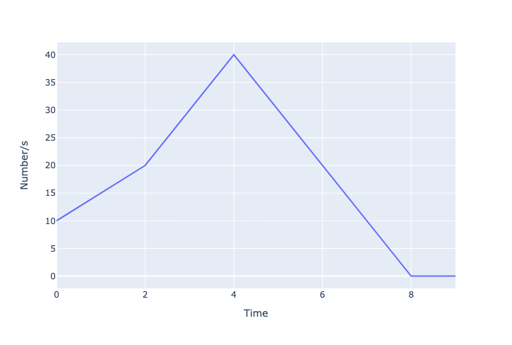
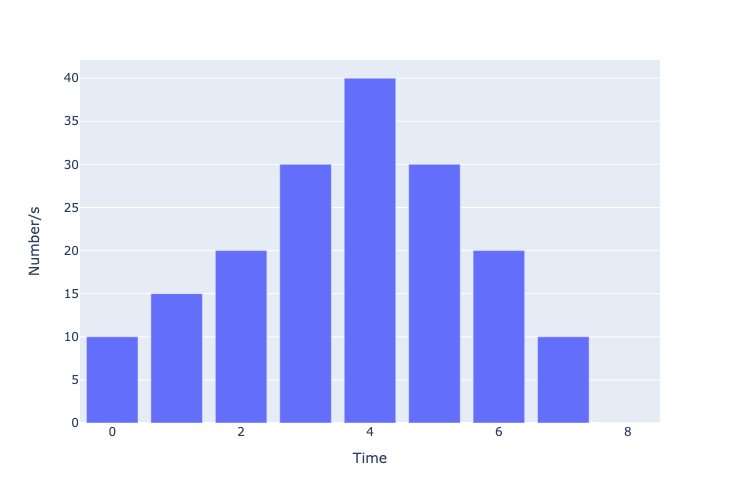

# Test Profiles
Test profiles are used to provide more dynamic profiles than simply setting a flat rate of files/s for sending test data. The test harness has the ability to create linearly interpolated values of files/s at second intervals for a simple csv input.
## Profile file structure
The profile should be provided to the test harness as a csv file with the following columns names
* `Number` - The integer number of files/s for the test harness to send at
* `Time` - The integer time in seconds (simulation time i.e. starting from 0) to set the rate of files/s at

The user needs only specify the rate at specific points in time and the test harness will linearly interpolate the files/s value for every second of simulation time between row entries in the csv file.

## Rules for entries
* The first row will specify the rate at which the test will start at - so if the start time is not 0 a flat rate of the input `Number` entry of that row will be assumed from zero until the `Time` entry of that row
* The end row/time of the csv specifies the rate given in the `Number` column at which the test will complete at, at the specific time given in the `Time` column. The actual time given here will not be included in the profile
* The test harness will linearly interpolate for every second of the test between adjacent entries in the csv if there is more than one second between them.

## Example input output
For the given test profile as input
```csv
Time,Number
0,10
2,20
4,40
6,20
8,0
9,0
```

The following interpolated profile for every second will infact be (with the number sent in the second `Time` column bin equal to the column `Number` i.e. 0 would be 10 files sent between 0 seconds and 1 second of the test)
```
Time,Number
0,10
1,15
2,20
3,30
4,40
5,30
6,20
7,10
8,0
```



