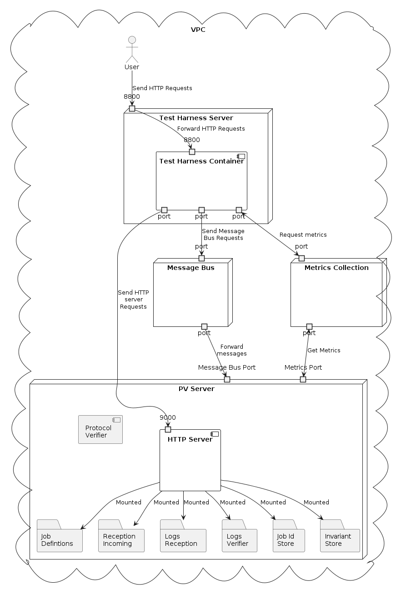

# Protocol Verifier
The specific deployment, configuration and usage options for the Test Harness when testing the Protocol Verifier.
## Installation and Image Build

### Quickstart
On MacOS, you can run the test harness with:
```sh
ssh-add --apple-use-keychain ~/.ssh/id_rsa # Add your private key used for SSH to apple keychain
docker compose up --build
```
NOTE: If the above doesn't work, check that you can access gitlab via git without user interaction (e.g. if you've added your SSH key to the apple keychain).

### <b>Pre-requisites</b>
To install and build this project one must have the following pre-requisites:
* python 3.11 (https://docs.python.org/3/whatsnew/3.11.html) and pip (or other python package manager) be installed on the machine that will be hosting the Test Harness (installation only)
* SSH access to the following git repositories:
    * git@github.com:SmartDCSITlimited/test-event-generator.git (this is not required but some functionality will be lost if test-event-generator is not present)
* Docker installed on the machine (build only)


### <b>Installation</b>
The project can be installed on the machine by choosing the project root directory as the working directory and running the following sequence of commands (it is recommended that a python virtual environment is set up so as not to pollute the main install):

* `./scripts/install_repositories.sh`
* `python3.11 -m pip install -r requirements.txt`

### <b>Build Image</b>
To build the docker image you must first be located in the project root directory and then run the following command (this assumes your ssh keys are in the default location on your machine):

`docker build -t <name(:optional tag)> --ssh default .`

***
## Deployment
### <b>Test Harness</b>
The Test Harness can be built and deployed as suggested in the main README.md file for this project.

It is recommended to deploy the test harness in the same VPC (or private network) as the machine containing the  Protocol Verifier and HTTP Server (see figure below of an example deployment) to avoid exposing the machine to public internet. 



### <b>HTTP Server</b>
The HTTP server is an intermediary device to allow the test harness to be separated from the PV machine and allows the http requests to upload files and download files (https://gitlab.com/smartdcs1/cdsdt/protocol-verifier-http-server). This can however be replaced by any intermediary as long as the end points server exactly the same purpose.
#### <b>Endpoints</b>
The deployment of the Test Harness must be used in conjuction with an HTTP server that has the following endpoints that provide functionality to upload, download, track and remove files from mounted folders:
* upload
    * `/upload/job-definitions` - End point to upload PV job definitions to <b>Job Definitions</b> folder
    * `/upload/events` - End point to send a file to <b>AER Incoming</b> folder
* download
    * `/download/verifier-log-file-names` - End point to receive the names of the files within <b>Logs Verifier</b> folder that contain the prefix <b>Verifier.log</b>
    * `/download/aer-log-file-names` - End point to receive the names of the files within <b>Logs Reception</b> folder that contain the prefix <b>Reception.log</b> 
    * `/download/verifierlog` - End point to download <b>Verifier.log</b> (or similar name) from the folder <b>Logs Verifier</b>
    * `/download/aerlog` - End point to download <b>Reception.log</b> (or similar name) from the folder <b>Logs Reception</b>
    * `/download/log-file` - End point to download named log files from the PV
    * `/download/log-file-names` - End point to get log file names from the PV
* folder clean up
    * `/io/cleanup-test` - Endpoint to remove all non hidden files from the folder mounted to the HTTP server
#### <b>Deploy</b>
The HTTP server is contained in the following repository (https://github.com/SmartDCSITlimited/protocol-verifier-http-server) and an image can be built by following instructions within that repository.

To deploy the HTTP server the following folders must be mounted (PV folder relative to cwd in deploy directory -> HTTP server):
* `./config -> /data/aeo_svdc_config` - CONFIG Folder mapping
* `./config/job_definitions -> /data/aeo_svdc_config/job_definitions` - Job Definitions Folder Mapping
* `./reception-incoming -> /data/events` - AER Incoming Folder mapping
* `./logs/verifier -> /data/logs/verifier` - Verifier Logs Folder mapping
* `./logs/reception -> /data/logs/reception` - Reception Logs mapping
* `./JobIdStore -> /data/job_id_store` - Job ID Store Folder mapping
* `./InvariantStore -> /data/invariant_store` - Invariant Store Folder mapping

The following Environment Variables must be set:
* `GIN_MODE=release`

The following ports must be forwarded (HTTP -> machine):
* `9000` - `9000`

The following extra arguments to the `docker run` command must be provided:
* `-path=/data`

The following docker compose file snippet added to the PV docker compose file will run the HTTP server (from inside the `munin/deploy` directory). One could also run this in a separate docker compose file.
```yaml
version: "3.9"
services:
  http_server:
    image: "http-server:latest"
    environment:
      - GIN_MODE=release
    volumes:
      - "./config/job_definitions:/data/aeo_svdc_config/job_definitions"
      - "./logs/verifier:/data/logs/verifier"
      - "./logs/reception:/data/logs/reception"
      - "./reception-incoming":"/data/events"
      - "./JobIdStore":"/data/job_id_store"
      - "./InvariantStore":"/data/invariant_store"
    ports:
      - 9000:9000
    command: "-path=/data"
```
#### <b>Configuration</b>
Default configuration for running the Test Harness can be found in the file `test_harness/config/default_config.config` (relative to the project root directory). This file contains default values for parameters that control the Test Harness. When deploying a bespoke Test Harness config the file must be placed in `deployment/config` and must have the name `config.config`.

Here we add the Protocol Verifier specific configuration needed for testing the PV that isn't present in the generic harness config in the root README.

To change default values of these files a parameter can be copied under the `[non-default]` heading in the file and set to a different value. Descriptions for parameters follows:
* General config
    * `requests_max_retries` - The number of times a synchronous request will retry to get the correct response before providing the wrong response. Defaults to `5`
    * `requests_timeout` - The timeout in seconds of a sychronous request. Defaults to `10`
* log reception and finishing time parameters
    * `log_calc_interval_time` (deprecated and can be set in test config under `test_finish` under subfield `metrics_get_interval` in the test config) - The interval time between requests for the log files. Defaults to `5`
    * `aer_get_file_url` - The url of the endpoint that requests are sent to receive a named log files for AER. Defaults to  `http://host.docker.internal:9000/download/aerlog`
    * `ver_get_file_url` - The url of the endpoint that requests are sent to receive a named log files for the Verifier. Defaults to `http://host.docker.internal:9000/download/verifierlog`
    * `aer_get_file_names_url` - The url of the endpoint that requests are sent to to obtain the names of the AER log files. Defaults to `http://host.docker.internal:9000/download/aer-log-file-names`
    * `ver_get_file_names_url` - The url of the endpoint that requests are sent to to obtain the names of the Verifier log files. Defaults to `http://host.docker.internal:9000/download/verifier-log-file-names`
    * `get_log_file_names_url` - The url of the endpoint that requests are sent to to obtain the names of log files. Defaults to `http://host.docker.internal:9000/download/log-file-names`
    * `get_log_file_url` - The url of the endpoint that requests are sent to receive a named log file for a specified PV domain. Defaults to `http://host.docker.internal:9000/download/log-file`
* Config relating to metrics collections
    * Kafka metrics collection config
        * `metrics_from_kafka` - Boolean indicating whether to collect metrics from a kafka topic. Defaults to `False``
        * `kafka_metrics_host` - The kafka host to collect the metrics from. Defaults to `host.docker.internal:9092`
        * `kafka_metrics_topic` - The topic to colect the metrics from. Defaults to `default.BenchmarkingProbe_service0`
        * `kafka_metrics_collection_interval` - An integer indicating the interval, in seconds, in which to collect metrics. Defaults to 1.
* Config relating to sending files
    * `message_bus_protocol` - The protocol to use for sending data to the application being tested. Currently supports the following two values (this will default to HTTP if any inccorect config is given):
        * HTTP - use the HTTP protocol to send data
        * KAFKA - use kafka to send data
        * KAFKA3 - use the kafka3 module for sending data (can be more performant)
    * Config relating to sending files to Kafka (if `message_bus_protocol` is set to "KAFKA" | "KAFKA3")
        * `kafka_message_bus_host` - The kafka host to send message to. Defaults to  `host.docker.internal:9092`
        * `kafka_message_bus_topic` The kafka topic to send messages to. Defaults to  `default.AEReception_service0`
    * Config relating to sending files to the HTTP server (if `message_bus_protocol` is set to "HTTP") TODO: Change this to reflect an arbitrary test
        * `pv_send_url` - The url of the endpoint that requests are sent to to upload events for reception and verification. Defaults to `http://host.docker.internal:9000/upload/events`
    * `pv_send_as_pv_bytes` - Boolean indicating whether to send data as pv bytes (True) or not (False). If the final destination is the kafka ingestion by the PV this is always set to True regardless of user input otherwise it should just be set to False. If set to True this will split all sent files into discrete json events and will add a byte array of length 4 in big endian of the integer size of the sent payload in byte.
* `pv_send_job_defs_url` - The url of the endpoint that requests are sent to to upload job definitions to. Defaults to `http://host.docker.internal:9000/upload/job-definitions`
* Config that is dependent on the config set on the Protocol Verifier
    * `pv_config_update_time` - The amount of time to wait for the uploaded job definition to be seen by the Protocol Verifier. Defaults to `60` (seconds). This should be greater than the field `SpecUpdateRate` of the PV
    * `pv_finish_interval` (deprecated can now be set in test config under `test_finish` with subfield `finish_interval`) - The amount of time thats is required for the Verifier logs to not have updated so that the Test Harness can finish the test. Defaults to `30`. It is recommended that this value be greater than the value of the fields (of the PV config) `MaximumJobTime` and `JobCompletePeriod`
* `pv_clean_folders_url` - The url of the endpoint that requests are sent to that clean the PV folders of all files relating to a test. Defaults to `http://host.docker.internal:9000/io/cleanup-test`
* `pv_clean_folders_read_timeout` - The amount of time to wait for a read timeout when cleaning the Protocol Verifier folders after a test. Defaults to `300` (seconds). It is recommended to set this value reasonably large for tests with a large amount of files.
* `pv_grok_exporter_url` (deprecated and will be removed) - The url of the endpoint that a request is sent to to obtain the grok parsed output of the PV log files. `http://host.docker.internal:9144/metrics`

The example harness config for the PV is shown below
```sh
[DEFAULT]
requests_max_retries = 5
requests_timeout = 10

# `log_calc_interval_time` will soon be deprecated and moved to test config
log_calc_interval_time = 5
aer_get_file_url = http://host.docker.internal:9000/download/aerlog
ver_get_file_url = http://host.docker.internal:9000/download/verifierlog
aer_get_file_names_url = http://host.docker.internal:9000/download/aer-log-file-names
ver_get_file_names_url = http://host.docker.internal:9000/download/verifier-log-file-names
get_log_file_url = http://host.docker.internal:9000/download/log-file
get_log_file_names_url = http://host.docker.internal:9000/download/log-file-names

metrics_from_kafka = False
kafka_metrics_host = host.docker.internal:9092
kafka_metrics_topic = default.BenchmarkingProbe_service0
kafka_metrics_collection_interval = 1

message_bus_protocol = HTTP
pv_send_url = http://host.docker.internal:9000/upload/events
kafka_message_bus_host = host.docker.internal:9092
kafka_message_bus_topic = default.AEReception_service0
pv_send_as_pv_bytes = False

pv_send_job_defs_url = http://host.docker.internal:9000/upload/job-definitions


pv_config_update_time = 60

# This should be greater than or equal to the job complete time in the config of the protocol verifier
# `pv_finish_interval` will soon be deprecated and moved to test config
pv_finish_interval = 30
# `pv_test_timeout` will soon be deprecated and moved to test config
pv_test_timeout = 5

pv_clean_folders_url = http://host.docker.internal:9000/io/cleanup-test
pv_clean_folders_read_timeout = 300

pv_grok_exporter_url = http://host.docker.internal:9144/metrics
[non-default]
```
***
## Usage
### <b>Test Configuration</b>
The specific extra Protocol Verifier config options for the .yaml file or JSON `TestConfig` in the `/startTest`

The fields within the json and yaml file are as follows:
* `type`: `"Functional"` | `"Perfomance"` : `str` - Indicates if the test is to be
    * `"Functional"` - A test of the functionality of the PV
    * `"Perfomance"` - A test of the performance of the PV 
* `max_different_sequences`: `int` `> 0` - Indicates the maximum number of different sequences to use in the tests
* `event_gen_options`: `dict` - Options for event sequence generation using the Test Event Generator. This option contains the following sub-fields: 
    * `solution_limit`: `int` `>= 0` - The max number of solutions to each ILP model in the Test Event Generator. This option can be used to limit how many solutions are found if the possibilities for a job definition are very large.
    * `max_sol_time`: `int` `>= 0` - The maximum time (in seconds) to run an ILP solution in the Test Event Generator. This option should be used to limit the time getting solutions to the ILP models if they are taking too long
    * `invalid`: `True` | `False` : `bool` - Boolean value indicating whether to include invalid sequences or not in the output
    * `invalid_types`: [
    `"StackedSolutions"` | `"MissingEvents"` | `"MissingEdges"` | `"GhostEvents"` | `"SpyEvents"` | `"XORConstraintBreaks"` | `"ANDConstraintBreaks"`
    ] : `list`[`str`] - A list of the invalid solutions to include if `invalid` is set to `True`
* `performance_options`: `dict` - Extra performance or more speicifc information for PV specific options for a perfomance test if `type` is set to `"Performance"`. This option contains the folloing sub-fields: 
    * `num_files_per_sec`: `int` `>= 0` - (PV specific) A uniform rate of the number of events to produce per second for sending to the PV when no profile has been uploaded (when they are sent will depend on whether the events are all sent as a batched job or if they are sharded into single event files using the `shard` option). If used in conjuction with `shard` set to `True` this will send single Events files at the prescribed rate
    * `shard`: `True` | `False` : `bool` - Boolean value indicating whether to shard job sequences into single event files (`True`) or send them in their relevant job batches (`False`)
    * `total_jobs`: `int` `>= 0` - The total number of separate jobs to use in the performance test if no profile has been uploaded.
    * `save_logs`: `True` | `False`: `bool` - Boolean value indicating whether to save logs (`True`) or no (`False`). Defaults to `True`
* `functional_options`: `dict` - Options for a functional test is `type` is set to `"Functional"`. This option contains the following sub-fields:
    * `log_domain`: `"aer"` | `"ver"` `str` : The log domain to use for the functional test, defaults to `"ver"`:
        * `"ver"` - Indicates that Verifier.log is the file to use for functional tests
        * `"aer"` - Indicated that Reception.log is the file to use for funtional tests
* `num_workers`: `int` - The number of worker processes to use for sending files. If this is equal to an integer of `0` or anything less the program will run in serial. If not equal to an integer the program will fail. Defaults to `0` and runs in serial.
* `aggregate_during`: `bool` - Boolean indicating whether to aggregate metrics during a test (`True`) or not (`False`). There is a small performance penalty for aggregating metrics during a test as the aggregations are computed on the fly. If `low_memory` option is set to `True` the input value from the user is ignored and metrics are aggregated during the test.  Defaults to `False` otherwise.
* `sample_rate`: `int` - Integer indicating the approximate number of "events" to sample per second (calculates a probability of `min(1, sample_rate/actual_rate)`) when saving results as the test proceeds for calculating metrics after the test is complete. If set to `0` or lower no sampling is performed. Defaults to `0`
* `low_memory`: `bool` - Boolean indicating whether to save results to memory/disk (`False`) or not (`True`) as the test proceeds. If set to `True` any metrics (calculated over time) that rely on knowing information when each "event" is sent and when it is received or processed by the system (this could be an unbounded amount of time before all quantities are available) cannot be calculated e.g. response times, queue times etc. If set to `True`, `aagregate_during` value is ignored and metrics are aggregated during the test. Defaults to `False`
* `test_finish`: `dict` - Options stopping a test. This option contains the following sub-fields: ,
   * `metric_get_interval`: `int` => 0, defaults to 5 - The interval with which to grab metrics that determine the end of a test
   * `finish_interval`: `int` => 0, defaults to 30 - The interval with which to calculate the end of a test if there has been no change in the grabbed metrics within that time. Should some integer multiple of `metric_get_interval`
   * `timeout`: `int` => 0, defaults to 120 - Time to wait before ending the test after all test data has been sent.

Examples of JSONs and YAMLs that could be used for the Protocol Verifier are given below
#### <b>Example Json test config</b>
```json
{
    "type":"Performance",
    "max_different_sequences": 100,
    "event_gen_options": {
        "solution_limit": 100,
        "max_sol_time": 120, 
        "invalid": true,
        "invalid_types": [
            "StackedSolutions", "MissingEvents"
        ]
    },
    "performance_options": {
        "num_files_per_sec": 10,
        "total_jobs": 100,
        "shard": false,
        "save_logs": true
    },
    "functional_options": {
        "log_domain": "ver"
    },
    "num_workers": 0,
    "aggregate_during": false,
    "sample_rate": 0,
    "low_memory": false
}
```

#### <b>Exmaple YAML test config</b>
```yml
type: "Functional"
max_different_sequences: 200
event_gen_options: 
  solution_limit: 100
  max_sol_time: 120
  invalid: False
  invalid_types: [
    "StackedSolutions", "MissingEvents", "MissingEdges",
    "GhostEvents", "SpyEvents", "XORConstraintBreaks",
    "ANDConstraintBreaks"
  ]
performance_options:
  num_files_per_sec: 10
  shard: False
  total_jobs: 100
  save_logs: True

functional_options:
  log_domain: "ver"

num_workers: 0

aggregate_during: False

sample_rate: 0

low_memory: False
```
***
### <b>Flask Service</b>
#### <b>Running the Service</b>
The flask service can be run in two ways:
* Following the instructions in <b>Deployment</b>:<b>Test Harness</b>:<b>Deploy</b> above. The following should then appear in stdout:
    ```sh
    [+] Building 0.0s (0/0)                                                             
    [+] Running 2/2
     ✔ Network test-harness_default           Cr...                                0.1s 
     ✔ Container test-harness-test-harness-1  Created                              0.0s 
    Attaching to test-harness-test-harness-1
    test-harness-test-harness-1  | INFO:root:Test Harness Listener started
    test-harness-test-harness-1  |  * Serving Flask app 'test_harness'
    test-harness-test-harness-1  |  * Debug mode: off
    test-harness-test-harness-1  | INFO:werkzeug:WARNING: This is a development server. Do not use it in a production deployment. Use a production WSGI server instead.
    test-harness-test-harness-1  |  * Running on all addresses (0.0.0.0)
    test-harness-test-harness-1  |  * Running on http://127.0.0.1:8800
    test-harness-test-harness-1  |  * Running on http://172.24.0.2:8800
    test-harness-test-harness-1  | INFO:werkzeug:Press CTRL+C to quit
    ```

* Following the instructions in <b>Installation and Image Build</b>:<b>Installation</b> and then running the following command from the project root (with a custom harness config file)

    `python -m test_harness.run_app --harness-config-path <path to harness config file>`

    Once one of this has been followed the following should appear in stdout of the terminal:
    ```sh
    INFO:root:Test Harness Listener started
     * Serving Flask app 'test_harness'
     * Debug mode: off
    INFO:werkzeug:WARNING: This is a development server. Do not use it in a production deployment. Use a production WSGI server instead.
     * Running on all addresses (0.0.0.0)
     * Running on http://127.0.0.1:8800
     * Running on http://172.17.0.3:8800
    INFO:werkzeug:Press CTRL+C to quit
    ```

#### <b>Running a Test</b>
A test for the PV can be run by using any of the four following stages (UML upload or zip upload containing a UML file must be run at a minimum however) and then running the `/startTest` endpoint, once the Flask service is running.:
* Upload of UML files (OPTIONAL) - PUML files that are the graphical representation of a Job Definition must be uploaded before a test can begin. This can be done by sending a POST request with the PUML file/s attached that are needed for the test to the endpoint `/uploadUML`. An example using `curl` is given below:
    
    ```sh
    curl --location --request POST 'http://127.0.0.1:8800/uploadUML' --form 'file1=@"ANDFork_ANDFork_a.puml"'
    ```
    This should receive a 200 OK response with the following body text `Files uploaded successfully`

* (OPTIONAL) A profile for a performance test can be uploaded as well in the form of a CSV file. The profile provides specific points (given in seconds) in simulation time where the number of test files sent per second is described. The csv must have the following headers in the following order: "Time", "Number". The Test Harness will linearly interpolate between these times to a discretisation of 1 second and will calculate how many test files are sent within that second (more info can be found in `docs/TestProfiles.md`). The end-point is called `/upload/profile` and is of mime type `multipart/form`. However only one file can be uploaded toherwise the Test Harness will raise an error and not run. An example usage is shown below:
    ```sh
    curl --location --request POST 'http://127.0.0.1:8800/upload/profile' --form 'file1=@"test_profile.csv"'
    ```

* (OPTIONAL) Test job event files can also be uploaded rather than producing them from the puml file given (note the test files uploaded must correspond to the PUML uploaded otherwise failures of the PV are guarenteed). A test file uploaded must have the following form:
    ```json
    {
        "job_file": <list of jsons of PV events>,
        "job_name": <string denoting name of job>,
        "SequenceType": <string denoting the type of sequence for functional tests>,
        "validity": <boolean indicating if the job file is should pass or fail in the PV>,
        "options" : <json of options>
    }
    ```
    The `options` json field currently supports the following options:
        * `invariant_matched` - Boolean indicating whether invariants that have the same name should match at runtime for a test event sequence
        * `invariant_length` - Integer value greater than or equal to 1 that specifies the length multiples of a 36 character length uuid that is produced for invariants
    An example file is shown below:
    ```json
    {
        "job_file": [
            {
                "jobId": "4f57f033-03e9-468c-b3b4-c144af8a3e20",
                "jobName": "test_uml_1",
                "eventType": "A",
                "eventId": "8628fdb6-48e7-4eab-9c9d-95bcbe48b7d0",
                "timestamp": "2023-09-21T14:35:09.728704Z",
                "applicationName": "default_application_name"
            },
            {
                "jobId": "4f57f033-03e9-468c-b3b4-c144af8a3e20",
                "jobName": "test_uml_1",
                "eventType": "B",
                "eventId": "ad46fae5-4970-4e7d-90d2-eb23d83f63ec",
                "timestamp": "2023-09-21T14:35:09.728783Z",
                "applicationName": "default_application_name",
                "previousEventIds": [
                    "8628fdb6-48e7-4eab-9c9d-95bcbe48b7d0"
                ]
            }
        ],
        "job_name": "test_uml_1",
        "sequence_type": "ValidSols",
        "validity": true,
        "options": {
            "invariant_matched": false,
            "invariant_length": 2
        }
    }    
    ```
    A more recent addition allows the upload of just an event stream JSON file (array of event JSON's). However, this assumes that file has `validity` equal to `true` an `sequence_type` as `"ValidSols"` with no extra options. An example is shown below
    ```json
    [
        {
            "jobId": "4f57f033-03e9-468c-b3b4-c144af8a3e20",
            "jobName": "test_uml_1",
            "eventType": "A",
            "eventId": "8628fdb6-48e7-4eab-9c9d-95bcbe48b7d0",
            "timestamp": "2023-09-21T14:35:09.728704Z",
            "applicationName": "default_application_name"
        },
        {
            "jobId": "4f57f033-03e9-468c-b3b4-c144af8a3e20",
            "jobName": "test_uml_1",
            "eventType": "B",
            "eventId": "ad46fae5-4970-4e7d-90d2-eb23d83f63ec",
            "timestamp": "2023-09-21T14:35:09.728783Z",
            "applicationName": "default_application_name",
            "previousEventIds": [
                "8628fdb6-48e7-4eab-9c9d-95bcbe48b7d0"
            ]
        }
    ],
    ```

    The endpoint `/upload/test-files` allows the upload of multiple test files and is of mime type `multipart/form`. An example curl request is shown below:
    ```sh
    curl --location --request POST 'http://127.0.0.1:8800/upload/test-files' --form 'file1=@"test_uml_1_events.json"'
    ``` 

* (RECOMMENDED) (OPTIONAL) This is the recommed way of gettingTest Case zip files may be uploaded to the Test Harness. These can include all the test data required to run the specific test. The zip file structure can vary based on the specific system tested but the basic implementation of the zip file would have the following structure unzipped
    ```sh
    TCASE
    ├── profile_store (optional)
    │   └── test_profile.csv (optional)
    ├── test_config.yaml (optional)
    ├── test_file_store (optional)
    │   └── test_uml_1_events.json (optional)
    └── uml_file_store (optional)
        └── test_uml_1.puml (optional)
    ```
    Note that all folders and files are optional in general within the zip file (this may not be the case for specific systems for example the `test_file_store` may need to be populated with template test data if the test for the specific system in question does not have a generator of test data). The folder can include:
    * `profile_store` - (OPTIONAL) This can be populated with a single profile for the test case detailing the time dependent rate at which single instances of test data will be sent. File format is found in `docs/TestProfiles.md`
    * `test_file_store` - (OPTIONAL: NOTE not optional if test-event-generator is not installed) This can be populted with arbitary template (or otherwise) test json data files that will be used in the test (test json file formats described above for the endpoint `/upload/test-files` documentation). Test file template files can be created using the cli tool (from project directory) `./test_harness/protocol_verifier/create_test_file_json.py` (usage is held within the script).
    * `uml_file_store` - (OPTIONAL) This can be populated with the required PUML job definition files for conversion and sending to the PV.
    * `test_config.yaml` - (OPTIONAL) This yaml file includes the test config used for the particular test case. If not present the test config in the JSON body of the `startTest` endpoint will be used (along with any defaults not set in the input config)
    
    The endpoint `/upload/named-zip-files` allows the upload of multiple test case zip file and is of mime type `multipart/form`. The file object name of the zip file in the form will be used to create the `TestName` (this is the name that needs to be input in the JSON body under the `TestName` field used with the `startTest` endpoint to run the test case) and will create a folder in the `report_output` folder under which all test data will be saved (WARNING: if the test name already exists this will overwrite all previous data within the output folder) An example curl request to upload a single test case zip file is shown below:
    ```sh
    curl --location --request POST 'http://127.0.0.1:8800/upload/named-zip-files' --form '<TestName here>=@"<Test zip file path>"'
    ``` 
* Start Tests Once all files required for the test have been uploaded to the harness the test can be started by sending a POST request with the JSON test data attached (must use header `'Content-Type: application/json'`) to the endpoint `/startTest`.

    The JSON can contain (but does not have to) the following fields:
    * `"TestName"`: `str` - A string representing the name of the test. If not provided a random uuid test name will be provided. Once a test is complete a directory will be created with the name given to the test and all report files relating to the test will be found within that directory. If a user would like to run a test case that has been uploaded using the `/upload/named-zip-files` endpoint then this field should refer to the file object name part of the form in that previous request.
    * `"TestConfig"`: `dict` - A JSON object like that given in <b>Example Json test config</b> above that provides the configuration for the test

    An example of a POST request using curl is provided below:
    ```sh
    curl -X POST -d '{"TestName": "A_perfomance_test", "TestConfig":{"event_gen_options":{"invalid":false}, "type":"Performance", "performance_options": {"num_files_per_sec":10, "total_jobs":100}}}' -H 'Content-Type: application/json' 'http://127.0.0.1:8800/startTest'
    ```

#### <b>Stopping a Test</b>
To stop a test gracefully once it is running one must send a POST request with a JSON body (must use header `'Content-Type: application/json'`) to the endpoint `/stopTest`. Currently the JSON accepted is empty. If succesful the response will be a `200 OK` and `400` if not. An example request is provided below:
```sh
curl -X POST -d '{}' -H 'Content-Type: application/json' 'http://127.0.0.1:8800/stopTest'
```
#### <b>Retrieving Output Data</b>
To retrieve output data from a finished test a POST request can be sent to the endpoint `/getTestOutputFolder` with a JSON body (must use header 'Content-Type: application/json'). The JSON body should specify the `TestName` given in the `/startTest` endpoint requets used to start the test. The JSON body should have the following form
```json
{
    "TestName": <name of test as string>
}
```
A correctly formed request will receive a response of a zip file (mime type `application/zip`) containing all the test output data within the folder at that time.
```sh
curl -X POST -d '{"TestName": "test_1"}' -H 'Content-Type: application/json' 'http://127.0.0.1:8800/getTestOutputFolder'
```
### <b>CLI Tool</b>
**WARNING this functionality is currently not working and will be updated **

Functionality has been provided to use the Test Harness as a CLI tool.

The test harness CLI can be run from the project root directory using the following command (this will run with default harness config, test config and output report directories):

`python -m test_harness <path to puml job def 1> ... <path to puml job def n>`

As is clear from the above one can use multiple puml files in a test harness run. Currently the following extra arguments are supported:
* `-o` or `--outdir` - Path to the output directory for the test report
* `--harness_config` - Path to a valid harness config file
* `--test_config` - Path to a test config yaml file like the example outlined in <b>Exmaple YAML test config</b>

An example of using the CLI tool with all of the options would be
```sh
python -m test_harness \
    --outdir <path to report output directory> \
    --harnes_config <path to custom harness config> \ 
    --test_conifg <path to custom test config yaml> \
    <path to puml job def 1> ... <path to puml job def n>`
```
### <b>Test reports and output</b>
Test reports can be found in a directory named after the `"TestName"` field sent in the POST request to `/startTest` endpoint. These directories are located in the `report_output` directory.
* For a run using the instructions in <b>Deployment</b>:<b>Test Harness</b>:<b>Deploy</b> the report output folder is located at `deployment/report_output` relative to the project root directory
* For a run using the command
    `python -m test_harness.run_app --harness-config-path <path to harness config file>`

    The report output folder is (by default) located at `test_harness/report_output` relative to the porject root directory. One can change this directory by editing the field `report_file_store` in the file `test_harness/config/store_config.config` and changing it to a path of the users choice
* For a run using the CLI tool the report output folder is (by default) located at `test_harness/report_output`. If the `--outdir` option is specified the report files will be saved to the relevant folder.
#### <b>Functional</b>
Within the directory of the specific test a Functional test will produce the following files:
* `Results.xml` - A junit representation of the test results
* `Results.html` - An html representation of the test results
* `Results.csv` - A csv representation of the test results
* `Results_Aggregated.html` - An interactive Stacked bar plot of HTML plot of results of successes, failures and unknowns categorised into type of test data

All of the job files of the test will also be saved within this folder so that if failures have occurred the user is able to pinpoint why the test may have failed.
#### <b>Performance</b>
Within the directory of the specific test a Performance test will produce the following files:
* `Report.xml` - XML file with JUNIT report of general results
* `Report.html` - HTML report of general results
* `AggregatedResults.csv` - CSV file containing all the aggregated results for each bin of a second
* `CumulativeEventsSentVSProcessed.html` - Interactive HTML plot of cumulative events (data points every second):
    * sent by test harness
    * processed by AER
    * fully process by the PV
* `EventsSentVSProcessed.html` - Interactive HTML plot of events/s (data points every second)
    * sent by test harness
    * processed by AER
    * fully processed by the PV   
* `ResponseAndQueueTime.html` - Interactive plot of (data points binned and averaged for every second)
    * Response times - average time taken for the PV to full process an event
    * Queue times - average time taken for an event to be picked up by AER

    Note that this will be an empty plot if `low_memory` option is used in test config
* `AggregatedErrors.csv` - (DEPRECATED) not useful since Kafka message bus
* `ProcessingErros.hmtl` - (DEPRECATED) not useful since Kafka message bus

